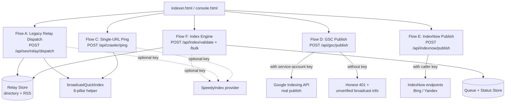
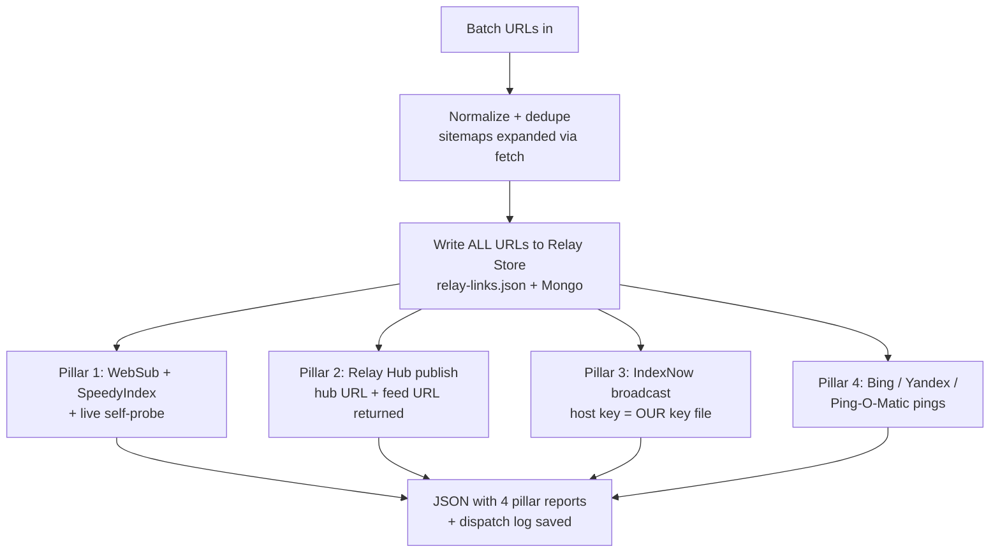
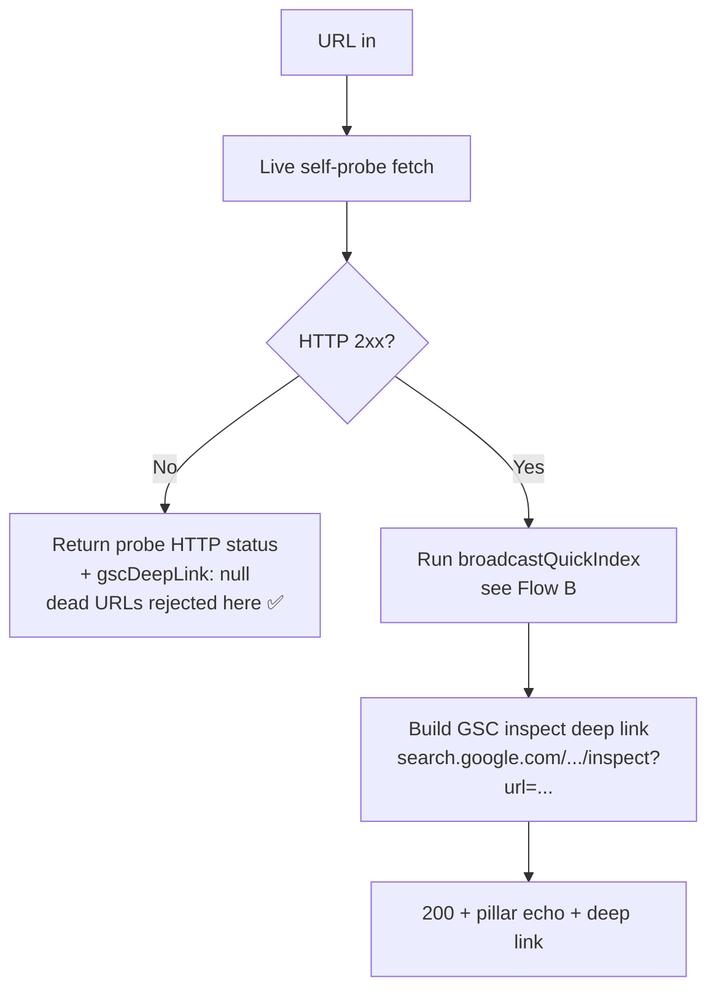
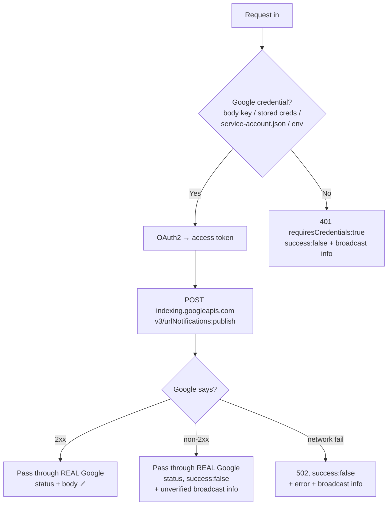
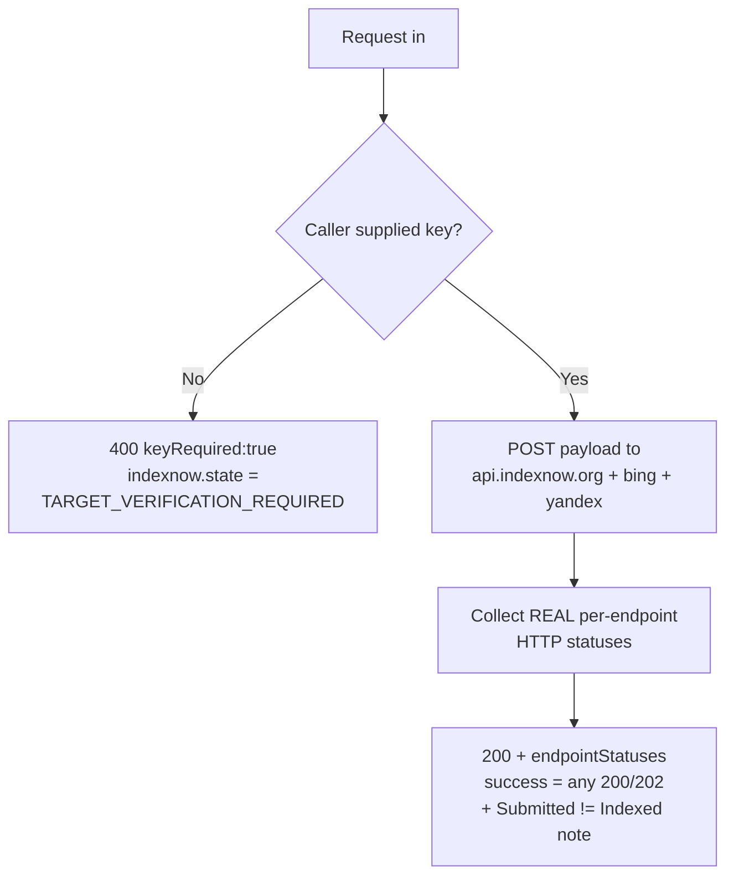
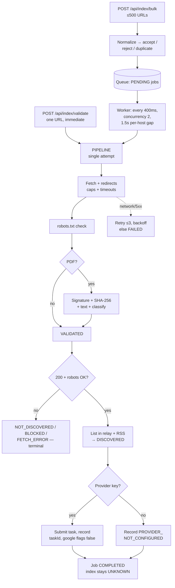
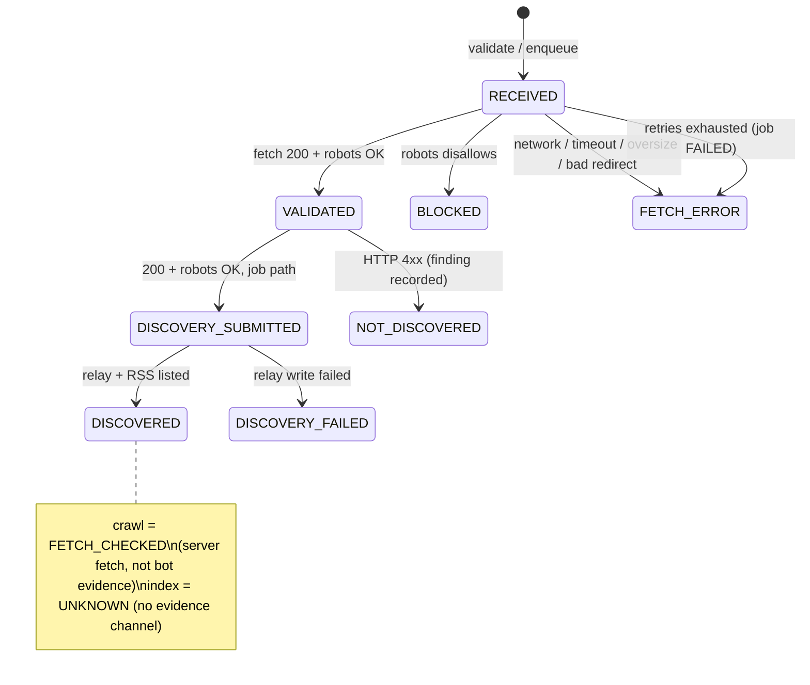
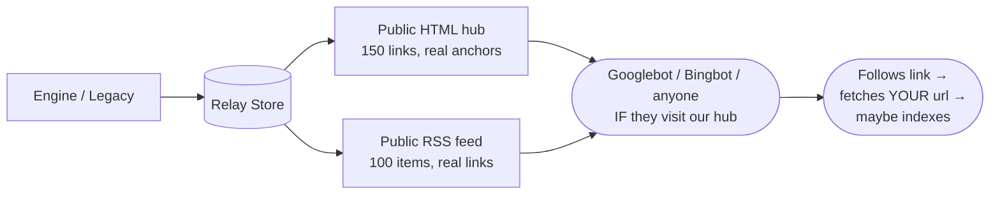

# INDEX MATRIX — How Indexing Works (Complete Detail)

> The definitive document on every indexing-related flow in this project:
> what happens step by step when a URL enters the system, what each step
> proves, and — just as important — what it does **not** prove.
>
> Core law, repeated everywhere in the code:
> **`Submitted ≠ Discovered ≠ Crawled ≠ Indexed`**

---

## 1. What "Indexing" Means in This Project

No button, ping, feed, or third-party provider in this system can force Google
(or any search engine) to index a URL. Indexing is a decision made only by the
search engine, after it crawls a URL and passes it through quality/spam filters.

So in INDEX MATRIX, "indexing flows" actually do four separate things:

| Stage | Meaning | Who decides it |
|---|---|---|
| **Submitted** | We transmitted the URL somewhere (queue, ping, API, feed) | Us — verifiable ✅ |
| **Discovered** | The URL sits on a surface a crawler *could* visit (our relay directory / RSS) | Us (listing) ✅ / crawler (visit) ❓ |
| **Crawled** | A search-engine bot fetched the URL | Search engine — we have **no evidence channel** |
| **Indexed** | The URL is in the search engine's index | Search engine — we have **no evidence channel** |

Anything this system reports about the **Crawled** and **Indexed** stages without
Search Console evidence would be fabrication — and the honest flows in this
project refuse to do that (they report `UNKNOWN` / `FETCH_CHECKED` instead).

---

## 2. Indexing Architecture — All Flows at a Glance



**Which flow should you use?**

| Situation | Use | Why |
|---|---|---|
| Validate + track URLs honestly (recommended) | **Flow F** (Index Engine) | Real states, retries, persistence, zero fabrication |
| Publish to Google for YOUR verified property | **Flow D** with service-account key | The only real Google channel |
| Notify Bing/Yandex for YOUR domain | **Flow E** with your key | Real IndexNow, real statuses |
| Quick single-URL ping + GSC deep link | **Flow C** | Convenience; ping value is minimal |
| Legacy batch form (existing UI) | **Flow A** | Kept for compatibility; 3 of 4 pillars are dead/no-op |

---

## 3. Flow A — Legacy Relay Dispatch (4 Pillars, In Detail)

**Endpoint:** `POST /api/seo/relay/dispatch`
**Input:** `{ urls: [...], sitemaps?: [...] }` (batch)
**Code:** `server.js` ≈ L2595–2850 + `db.saveRelayLinks`



### Pillar 1 — Google WebSub + SpeedyIndex + self-probe

1. `POST https://pubsubhubbub.appspot.com/` with `hub.mode=publish&hub.url=<each-url>`.
   **Reality:** a WebSub hub only notifies *subscribers of a feed*. Random URLs have
   no subscribers, so this is a no-op for discovery. The HTTP status (usually 204)
   only proves the hub received the form post.
2. `POST https://api.speedyindex.com/v2/task/google/indexer/create` with
   `{ urls, title, pay_per_indexed: true }`, header `Authorization: <key>`.
   Key resolution: `SPEEDYINDEX_API_KEY` → `INDEXER_API_KEY` → hardcoded fallback.
   **Reality:** proves only that a third-party accepted a task (`task_id`). It is
   not Google crawl or index evidence.
3. **Self-probe:** our server `fetch()`es the first URL with a Googlebot-like
   User-Agent and records HTTP status + latency.
   **Reality:** proves the URL loads *for us*. Google learns nothing from this.
   It must be read as "SERVER FETCH / TECHNICAL PROBE", never as a crawl.

### Pillar 2 — Relay Crawl Hub publication

Returns the public hub + feed URLs that now list the submitted links:

- `/api/seo/indexing-hub.html` — HTML directory of links (up to 150)
- `/api/seo/indexing-feed.xml` — RSS 2.0 feed (up to 100)

**Reality:** this is the flow's only *structurally sound* discovery surface: real
links on real public pages that a crawler visiting those pages could follow.
"Could" is doing heavy lifting — our hub is low-authority and rarely crawled.

### Pillar 3 — IndexNow "gateway" broadcast

Sends `{ host, key, keyLocation, urlList }` to `api.indexnow.org`, `bing.com/indexnow`,
`yandex.com/indexnow`, where `host`/`key` identify **our server** (key file
`/<INDEXNOW_RELAY_KEY>.txt` served from our host) but `urlList` contains the
**user's third-party URLs**.
**Reality:** IndexNow verifies that the key belongs to the host *of the submitted
URLs*. Our key cannot authorize third-party URLs, so engines reject these. The
response message claiming "Client domain verification bypassed" is false and is
scheduled for removal — treat this pillar as dead.

### Pillar 4 — Bing / Yandex / Ping-O-Matic pings

- `GET https://www.bing.com/ping?sitemap=<guessed-origin/sitemap.xml>` (fire-and-forget, response unread)
- `GET https://blogs.yandex.ru/pings/?status=success&url=<hubUrl>` (blog-ping service)
- `POST http://rpc.pingomatic.com/` XML-RPC (blog directories)

**Reality:** none of these submit the user's actual URLs for indexing; responses are
never read. Theater, kept for backward compatibility.

### Flow A verdict

| Pillar | Proves | Indexing value |
|---|---|---|
| 1a WebSub | Hub got a form post | ~0 |
| 1b SpeedyIndex | Third party queued a task | Low, unverified |
| 1c Self-probe | URL loads for us | Diagnostic only |
| 2 Relay hub/feed | Links publicly listed | Low but real |
| 3 IndexNow | Request transmitted | ~0 (key mismatch → rejected) |
| 4 Pings | Packets sent | ~0 |

---

## 4. Flow B — `broadcastQuickIndex()` (Shared 8-Step Helper)

**Code:** `server.js` (`broadcastQuickIndex`). Used by Flow D fallbacks and parts of Flow C.
Sends, for one URL: Google WebSub post → Superfeedr post → **`google.com/ping`**
→ Bing sitemap pings → Yandex blogs ping → IndexNow with `md5(hostname)` key →
Ping-O-Matic XML-RPC → SpeedyIndex task. Almost all fire-and-forget.

Two facts that kill most of it:

1. **`https://www.google.com/ping` has been dead since end-2023.** Google deprecated
   the sitemap-ping endpoint; it returns 404 and does nothing. Any code path that
   "pings Google" via this URL is a confirmed no-op.
2. **The IndexNow key is `md5(hostname)` with a `keyLocation` file that does not
   exist** on the target domain → verification fails → Bing/Yandex reject.

Net value of Flow B: the SpeedyIndex task (if a key exists) plus log lines.
Everything else is outbound noise. It is preserved only so legacy callers keep
running; new code must not depend on it.

---

## 5. Flow C — Single-URL Ping (`/api/crawler/ping`)

**Endpoint:** `POST /api/crawler/ping` · **Input:** `{ url }`



**Honest notes:** the dead-URL rejection (real probe status, `gscDeepLink: null`) is
good behavior. But the response echoes `bing/yandex/indexNow: { accepted: true }`
as **static claims not derived from responses** — do not trust those fields. The
deep link is a convenience URL for a human to open in Search Console; opening it
is the operator's job — the API does not submit anything to Google.

---

## 6. Flow D — GSC Publish (`/api/gsc/publish`, Real Google Channel)

**Endpoint:** `POST /api/gsc/publish` · **Input:** `{ url, type?, serviceAccountKey?, bearerToken? }`



This is the **only flow that can genuinely notify Google**, and only when:

1. The caller supplies a service-account key or OAuth token, **and**
2. That identity has access to the Search Console property, **and**
3. (Per Google's own rules) the URL type fits the Indexing API's allowed scope.

All three non-success branches still send the legacy unverified broadcast (behavior
preserved) but report it **as** an unverified broadcast — `autoIndexed: false`,
never a fake "successfully auto-indexed".

---

## 7. Flow E — IndexNow Publish (`/api/indexnow/publish`)

**Endpoint:** `POST /api/indexnow/publish` · **Input:** `{ url, key, keyLocation? }`



No key generation, no "zero-configuration for third-party websites" (that old
behavior fabricated `md5(host)` keys and is removed). The engines still verify
the key file on the target domain — a 200 from the endpoint means "received",
not "verified", "crawled", or "indexed".

---

## 8. Flow F — Index Engine (`/api/index/*`, The Honest Pipeline)

The recommended flow. Three entry points, one pipeline, persisted states.



### 8.1 Validation details (every check, in order)

1. **Normalize** — trim; must match `http(s)://`; lowercase host; strip default
   port + fragment; ≤2048 chars. Failures: `INVALID_URL`, `UNSUPPORTED_PROTOCOL`
   (e.g. `ftp:`), `BLOCKED_HOST` (`169.254.169.254`, `0.0.0.0`).
2. **Fetch** — manual redirect loop (max 5, http(s) only, records each hop
   `{from, status, to}`). Per-hop timeout 15 s. Byte caps: 35 MB for PDF
   candidates, 512 KB sniff for pages. **Oversize is caught twice:** declared
   `Content-Length` upfront, then stream abort for lying servers.
3. **robots.txt** — fetches `{origin}/robots.txt` (6 s, 100 KB), minimal
   `Allow/Disallow` matching for `*`/our UA against the path:
   `AVAILABLE` (allowed) / `BLOCKED` (disallowed → discovery skipped politely) /
   `UNKNOWN` (unfetchable → recorded, not assumed).
4. **PDF analysis** (only if content-type sniff says PDF): `%PDF-` signature →
   SHA-256 of bytes → text extraction → `TEXT_PDF` (≥100 chars) /
   `SCANNED_OR_EMPTY_PDF` / `NOT_A_PDF` (e.g. HTML wearing a `.pdf` name).
5. **Ownership label** — `SELF` if host ∈ `OWN_DOMAINS` (or localhost test rig),
   else `THIRD_PARTY`. Used for honest reporting, not for access control.

### 8.2 Queue & worker details

- **Dedupe:** one PENDING/RUNNING job per normalized URL; re-submits return
  `ALREADY_QUEUED` / `DUPLICATE_IN_BATCH`. Re-checks are allowed after completion.
- **Scheduling:** oldest-due first; a job whose host was hit <1.5 s ago is skipped
  until the gap passes (polite crawling of third-party hosts).
- **Retry math:** attempt `n` fails transiently → `nextRunAt = now + 20s × n`.
  After attempt 3 → `FAILED`. Deterministic outcomes (4xx, oversize, robots-deny,
  bad redirect) complete immediately — retrying them would be pointless load.
- **Isolation:** provider exceptions, relay-write failures, and worker exceptions
  are caught per-job; one bad URL can never stall or crash the queue.
- **Bounds:** 500 terminal jobs, 2000 status records (oldest pruned); all writes
  atomic (temp file + rename); corrupt files quarantined to `.corrupt-*.bak`.

### 8.3 State machine (complete)



### 8.4 Monitoring endpoints

- `GET /api/index/health` — worker alive? in-flight count? provider configured?
  active limits. Reports `speedyindex.configured: false` rather than inventing a key.
- `GET /api/index/queue` — `pending/running/completed/failed/total` + recent jobs.
- `GET /api/index/status` (+ `?state=`, `?limit=`) — records newest-first + counts.
- `GET /api/index/status/by-url?url=` — one record or honest 404 ("not tracked yet").

---

## 9. End-to-End Trace — One PDF URL Through the Engine

Input: `POST /api/index/bulk` → `{ "urls": ["http://example.com/files/report.pdf"] }`
(Third-party host used as an example; the engine validates anything but can only
*list and monitor* — it cannot force indexing anywhere.)

| Step | What happens | Stored state |
|---|---|---|
| 1. Bulk intake | Normalized, no active dup → PENDING job `#a1` | `RECEIVED` |
| 2. Worker pickup | Oldest due, host cool → RUNNING | `RECEIVED` (attempt 1) |
| 3. Fetch | `200`, `application/pdf`, 842 KB, 612 ms, 0 redirects | … |
| 4. robots | `/robots.txt` fetched, path allowed | `robots.state: AVAILABLE` |
| 5. PDF | `%PDF-` ✅, sha256 `9f2c…`, 1,204 chars → `TEXT_PDF` | `VALIDATED` |
| 6. Discovery | Appended to relay store → visible in hub + feed | `DISCOVERED` |
| 7. IndexNow | No caller key → not sent | `TARGET_VERIFICATION_REQUIRED` |
| 8. Provider | No key configured → skipped | `PROVIDER_NOT_CONFIGURED`, google flags `false/false` |
| 9. Done | Job `COMPLETED` | crawl `FETCH_CHECKED`, index `UNKNOWN` |

Final record (shape):

```json
{
  "state": "DISCOVERED",
  "ownership": "THIRD_PARTY",
  "validation": { "httpStatus": 200, "contentType": "application/pdf",
    "contentLength": 862208, "responseMs": 612, "redirects": [],
    "robots": { "state": "AVAILABLE", "allowed": true } },
  "pdf": { "isPdf": true, "valid": true, "textLength": 1204,
    "sha256": "9f2c…", "classification": "TEXT_PDF" },
  "discovery": { "state": "DISCOVERED", "relayListed": true, "feedListed": true,
    "indexnow": { "state": "TARGET_VERIFICATION_REQUIRED" },
    "provider": { "provider": "SpeedyIndex", "accepted": false,
      "reason": "PROVIDER_NOT_CONFIGURED",
      "googleCrawlConfirmed": false, "googleIndexedConfirmed": false } },
  "crawl": { "state": "FETCH_CHECKED" },
  "index": { "state": "UNKNOWN" }
}
```

The dashboard's **Index Engine Monitor** (`indexer.html`) renders exactly these six
columns — URL · Submission · Discovery · Crawl · Index · Detail — refreshed every 5 s.

---

## 10. How Discovery Actually Happens (A Crawler's-Eye View)



Three honest caveats:

1. Discovery requires the crawler to visit **our** hub/feed first — a new,
   low-authority surface with no inbound links is crawled rarely.
2. Even a followed link only earns a **crawl**, after which quality/spam filters
   decide on **indexing** (`Crawled — currently not indexed` is common).
3. Orphan third-party files (no inbound links anywhere, spam-adjacent URL
   patterns) are the weakest candidates in this chain.

---

## 11. Capability Matrix — What Each Flow Proves

| Capability | A Legacy | B Helper | C Ping | D GSC+key | E IN+key | F Engine |
|---|---|---|---|---|---|---|
| Validates URL technically | ⚠️ partial | ❌ | ⚠️ probe | ❌ | ❌ | ✅ full |
| Detects + analyzes PDFs | ❌ | ❌ | ❌ | ❌ | ❌ | ✅ |
| Checks robots.txt | ❌ | ❌ | ❌ | ❌ | ❌ | ✅ |
| Queues + retries honestly | ❌ | ❌ | ❌ | ❌ | ❌ | ✅ |
| Lists on public discovery surface | ✅ | ❌ | ❌ | ❌ | ❌ | ✅ |
| Notifies Google (real) | ❌ | ❌ | ❌ | ✅ | ❌ | ❌ |
| Notifies Bing/Yandex (real) | ❌ | ❌ | ❌ | ❌ | ✅ received* | ❌ |
| Proves crawl happened | ❌ | ❌ | ❌ | ❌ | ❌ | ❌ |
| Proves indexing happened | ❌ | ❌ | ❌ | ❌ | ❌ | ❌ |

\* "Received" — engines still verify the domain key before acting.

---

## 12. Latency & Throughput (Typical, Localhost Worker)

| Operation | Time |
|---|---|
| Single `/validate` (small page/PDF) | 0.5–3 s (+ target latency) |
| Bulk intake (500 URLs) | < 1 s (enqueue only) |
| Queue drain, 100 URLs, 2 hosts | ≈ 2–6 min (fetch time + 1.5 s/host gap) |
| Retry backoff | +20 s / +40 s / +60 s |
| Monitor refresh | 5 s polling |

---

## 13. Failure Modes & Troubleshooting

| Symptom | Check | Meaning |
|---|---|---|
| `FETCH_ERROR / FETCH_FAILED` | Target down? Sandbox offline? | Network/DNS/timeout; retries then FAILED |
| `OVERSIZED` | File > 35 MB? | Cap enforced; raise `INDEX_PDF_MAX_MB` if legitimate |
| `BLOCKED` | `robots.state` | Target disallows the path — stop, don't hammer |
| `NOT_DISCOVERED` + HTTP 4xx | `validation.httpStatus` | Correct finding: validation passed, resource missing |
| `PROVIDER_NOT_CONFIGURED` | `.env` key empty | Expected without a key — not an error |
| `TARGET_VERIFICATION_REQUIRED` | No caller key | Expected — IndexNow needs domain ownership |
| Legacy "success" but nothing indexed | Read §3 verdict table | Expected — most legacy pillars are no-ops |
| `index: UNKNOWN` everywhere | By design | No evidence channel exists; this is the honest state |

---

## 14. Glossary

- **Relay / Feed Hub** — our public link directory + RSS feed (operator-owned discovery surface).
- **FETCH_CHECKED** — our server fetched the URL. Technical fact, zero crawl evidence.
- **TARGET_VERIFICATION_REQUIRED** — IndexNow refused: no verified domain key supplied.
- **WebSub ping** — a form post to a hub; meaningless without feed subscribers.
- **Self-probe** — our server fetching a URL while wearing a bot User-Agent; purely diagnostic.
- **Churn-and-burn** — spam dynamic where a URL indexes briefly, then deindexes in a spam wave. No flow here can prevent that — it is an engine-side decision.

---

*Companion docs: `PROJECT_FLOW.md` (Hinglish overview) · `PROJECT_PROMPT.md` (dev context) · `VERIFICATION_REPORT.md` (test evidence). Server: `http://localhost:8080` · Engine worker: ACTIVE.*
