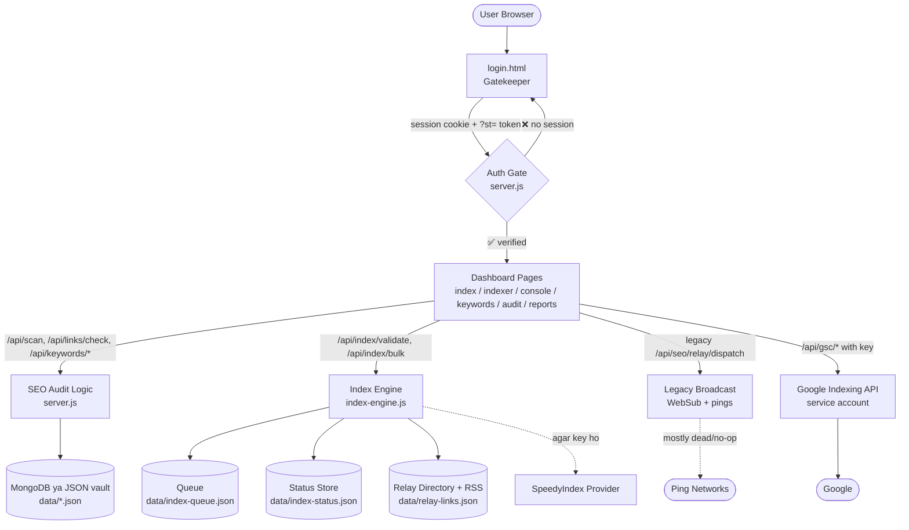
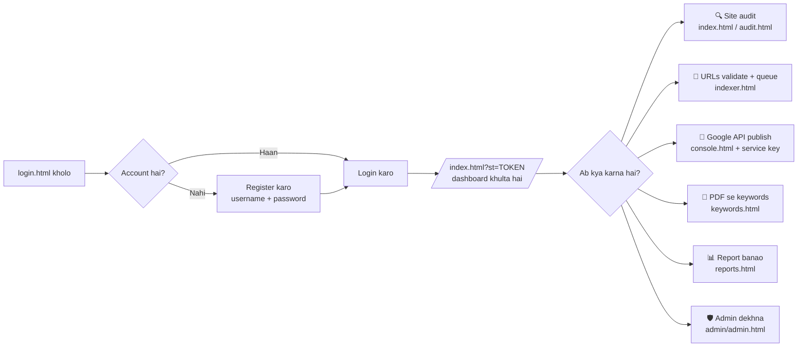
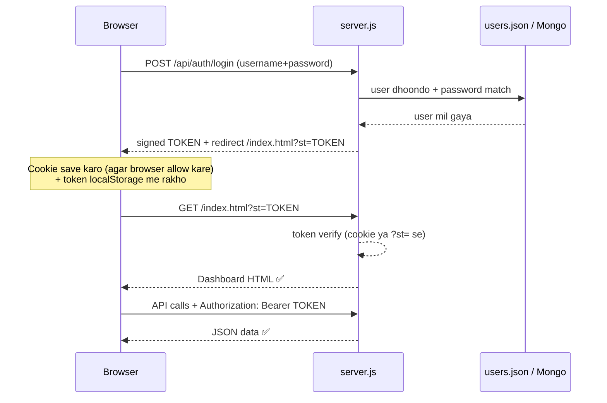
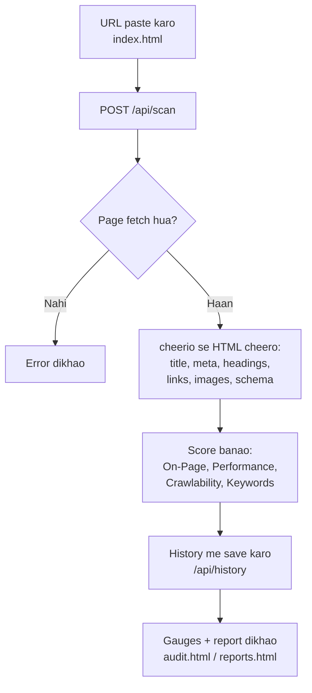
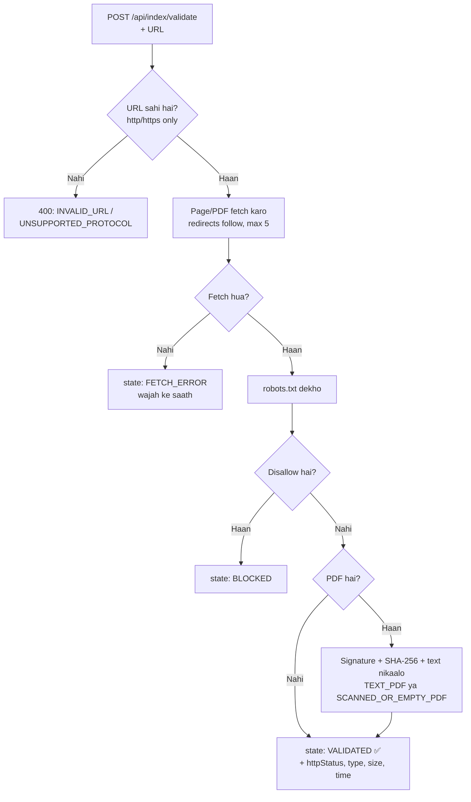
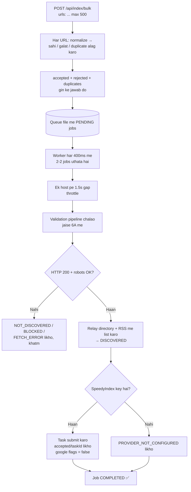
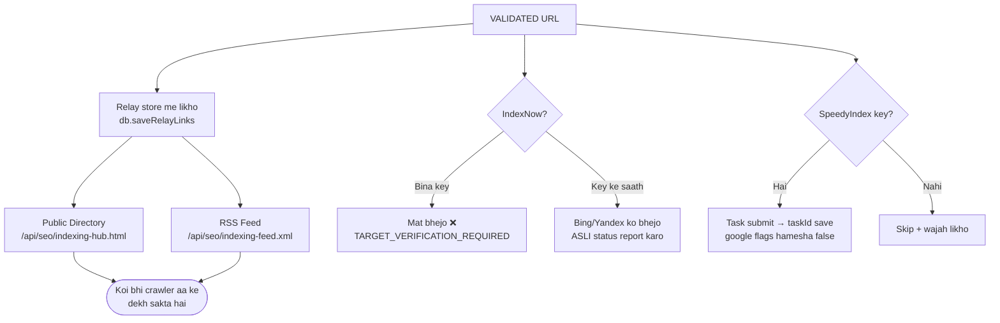
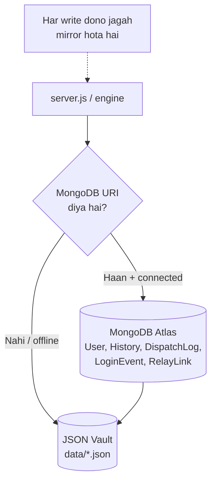
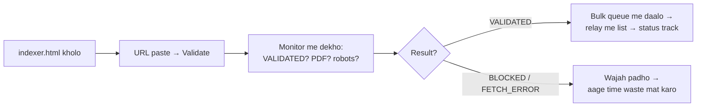

# INDEX MATRIX — Pura Project Flow (Ek Document Me Sab Kuch)

> Ye doc batata hai: project **kya hai**, **kaise kaam karta hai**, **kaise chalaoge**,
> aur uske liye **kya-kya chahiye**. Technical shabda English me, samjhaya Hinglish me.

---

## 1. Project Ek Nazar Me

**INDEX MATRIX** ek self-hosted **SEO + Indexing dashboard** hai — ek hi login, ek hi port (`8080`).
Iske **2 hisse** hain:

| # | Hissa | Kya karta hai | Kahan |
|---|---|---|---|
| 1 | **SEO Audit Toolkit** | Kisi bhi website ko scan karo — health score, toote links, keywords, PDF se keywords, competitor gap, client report | `index.html`, `audit.html`, `keywords.html`, `reports.html` |
| 2 | **Bot Indexer + Index Engine** | URLs ko validate karo, queue me daalo, discovery pings bhejo, aur **honest status** track karo (Submitted ≠ Discovered ≠ Crawled ≠ Indexed) | `indexer.html`, `console.html`, `/api/index/*` |

**Golden rule (poore project me):** koi bhi button, ping ya provider **Google se index nahi karwa sakta**.
System sirf *validate + submit + monitor* karta hai — index karna Google ka faisla hai.

---

## 2. System Map — Sab Kuch Kaise Juda Hai



---

## 3. User Journey — Login Se Lekar Kaam Tak



---

## 4. Auth Flow — Login Kaise Kaam Karta Hai



**Kyun 2 tareeke (cookie + `?st=`)?** Preview/iframe me browser kabhi cookie block kar deta hai —
tab `?st=` token aur Bearer header se kaam chalta hai. Dono me se ek chalega to login tikega.

**Safety:** 5 galat password pe IP 15 min block. `user` role history delete nahi kar sakta (403) —
sirf `admin` kar sakta hai. Admin panel sirf localhost (apne computer) se khulta hai.

---

## 5. SEO Audit Flow — Site Scan Kaise Hota Hai



**Sahayak tools (same pattern — page → API → result → history):**

| Kaam | Page | API |
|---|---|---|
| Toote links check | audit.html | `POST /api/links/check` |
| Sitemap se URLs nikaalo | indexer.html (import) | `POST /api/sitemap/extract` |
| PDF/TXT/DOCX se keywords | keywords.html | `POST /api/upload-file` |
| Competitor se tulna | keywords.html | `POST /api/keywords/compare` |
| Score ka graph (velocity) | reports.html | `GET /api/history/timeline` |
| GSC property inspect | console.html | `POST /api/gsc/inspect` |

---

## 6. Index Engine Flow — Naya Honest Pipeline (Dil Se Samjho)

Ye project ka sabse important flow hai. **2 raste** hain — turant check ya queue:

### 6A. Turant Validation (ek URL, abhi)



### 6B. Bulk Queue (bahut saare URLs)



### 6C. Retry — Fail Pe Kya Hota Hai

- **Network fail / timeout / HTTP 500** → dobara try (max 3 baar, badhta gap: 20s, 40s, 60s) → phir bhi fail to job **FAILED**, status **FETCH_ERROR**.
- **HTTP 404 / galat file / oversize / robots-block** → retry bekaar hai → turant **COMPLETED** + sahi status likho (NOT_DISCOVERED / BLOCKED / FETCH_ERROR).
- **Provider fail** → job fail NAHI hota — error likh ke aage badho.

### 6D. Status Ka Matlab (Ye Table Yaad Rakho)

| Status | Matlab | Kab |
|---|---|---|
| `RECEIVED` | URL mil gaya | Enqueue / validate start |
| `VALIDATED` | Technical check pass | Fetch + robots OK |
| `DISCOVERED` | Hamari relay/RSS me list hua | Queue job success |
| `BLOCKED` | robots.txt mana karta hai | Disallow mila |
| `NOT_DISCOVERED` | List karne layak nahi | 404 waghaira |
| `FETCH_ERROR` | Fetch hi nahi hua | Network/timeout/oversize |
| `DISCOVERY_FAILED` | Relay me likhna fail | File/DB error |
| `FAILED` (job) | Retry khatm | 3 attempts fail |
| crawl: `FETCH_CHECKED` | **Hamare server** ne fetch kiya | Hamesha (ye Googlebot proof NAHI) |
| index: `UNKNOWN` | Pata nahi index hua ya nahi | **Hamesha** (sach — hamare paas evidence channel nahi) |

---

## 7. Discovery Flow — Relay, Feed, Provider, IndexNow



**Seedhi baat:** Relay/feed = *hamari* dukaan ki khidki (public, crawler aa sakta hai).
Provider = *bahar ki* service (paisa/key chahiye, guarantee zero).
IndexNow = *bina domain key ke bilkul nahi* (fake key = reject pakka).

---

## 8. Legacy Broadcast Flow — Purana Rasta (Warning Ke Saath)

`indexer.html` ka purana form `/api/seo/relay/dispatch` hit karta hai jo ye karta hai:

1. URLs ko relay store me daalta hai ✅ (ye hissa sahi hai)
2. WebSub hubs ko ping bhejta hai ⚠️ (koi subscriber nahi → asar zero)
3. `google.com/ping` bhejta hai ❌ (**2023 se band endpoint** — 404 aata hai, bekaar hai)
4. Fake-key IndexNow bhejta hai ❌ (**verify fail → reject pakka**)
5. Bing/Yandex/Ping-O-Matic fire-and-forget ⚠️ (jawab dekha hi nahi jaata)
6. SpeedyIndex task ✅/⚠️ (key ho to task banta hai, guarantee zero)

**Niyam:** naya kaam **hamesha Index Engine (`/api/index/*`) se karo**. Legacy rasta sirf
purana UI chalta rahe isliye rakha hai — dheere-dheere usko engine pe shift karna hai.

---

## 9. Data Flow — Kahan Kya Save Hota Hai



| File / Collection | Kya rehta hai | Limit |
|---|---|---|
| `data/users.json` | Accounts + password/username history | — |
| `data/history.json` | Scan/audit projects | — |
| `data/dispatch-logs.json` | Legacy broadcast logs | — |
| `data/relay-links.json` | Relay/feed links + `botPingCount` | 500 (purane nikalte hain) |
| `data/login-events.json` | Login/logout events | — |
| `data/index-queue.json` | Engine jobs | 500 terminal jobs |
| `data/index-status.json` | Per-URL honest status | 2000 records |
| `service-account.json` | (optional) Google key — **kabhi Git me mat daalo** | — |

**Crash safety:** har JSON write atomic hai (pehle temp file, phir rename). File kharab
ho jaye to `.corrupt-<time>.bak` me side karke nayi shuru — app kabhi crash nahi hota.

---

## 10. Kya-Kya Chahiye (Needs) — Poori List

### 10A. Chalane Ke Liye (must-have)

| Cheez | Detail |
|---|---|
| **Node.js** | v18+ (tested: v22.22.3) |
| **npm** | Node ke saath aata hai (tested: 10.9.8) |
| **Port 8080** | Khali hona chahiye (ya `PORT=` se badlo) |
| **`.env` file** | Repo me sample ready — bina iske bhi chalega (defaults), par bina `SESSION_SECRET` ke production mat chalao |
| **Browser** | Koi bhi modern (Chrome/Edge/Firefox) |

### 10B. `.env` Keys — Kaun Zaroori, Kaun Optional

| Key | Zaroori? | Matlab / Default |
|---|---|---|
| `PORT` | Nahi | 8080 |
| `SESSION_SECRET` | **Production me HAAN** | Login tokens ka sign key (dev default hai, prod me badlo) |
| `MONGODB_URI` / `MONGO_URI` | Nahi | Khali = JSON vault pe chalo (sab kuch chalega) |
| `SPEEDYINDEX_API_KEY` | Nahi | Khali = provider skip + wajah likhi jayegi |
| `INDEX_QUEUE_CONCURRENCY` | Nahi | Ek saath kitne jobs (2) |
| `INDEX_PER_HOST_DELAY_MS` | Nahi | Ek host pe gap (1500ms — polite crawling) |
| `INDEX_PDF_MAX_MB` | Nahi | PDF size cap (35 MB) |
| `INDEX_MAX_ATTEMPTS` | Nahi | Retry limit (3) |
| `INDEX_FETCH_TIMEOUT_MS` | Nahi | Fetch timeout (15s) |
| `OWN_DOMAINS` | Nahi | Tumhare domains (comma list) — SELF vs THIRD_PARTY label ke liye |
| `GOOGLE_SERVICE_ACCOUNT_KEY` | Nahi | GSC publish ke liye (ya UI se key do) |

### 10C. Bahar Ke Accounts (sab optional)

| Account | Kyun | Bina iske? |
|---|---|---|
| MongoDB Atlas (free) | Bada data, multi-device | JSON vault pe sab chalega |
| SpeedyIndex key | Third-party discovery task | Skip + honest note |
| Google Cloud service account | Indexing API publish (apni GSC-verified property ke liye) | Honest 401 + unverified broadcast info |
| IndexNow key | Apne domain ke liye Bing/Yandex notify | `TARGET_VERIFICATION_REQUIRED` |

### 10D. Production Me (jab duniya ke liye kholo)

- **Process manager:** PM2 ya systemd (`node server.js` ko zinda rakhe + restart kare)
- **Reverse proxy + HTTPS:** Nginx/Caddy (login tokens ke liye HTTPS must hai)
- **Firewall:** `/admin` waise bhi localhost-only hai — aise hi rakho
- **Backup:** `data/*.json` ka roz backup (agar Mongo nahi hai)
- **Internet:** audit/scan/engine-fetch ko bahar ka net chahiye; login/dashboard/history offline bhi chalega

---

## 11. Chalane Ka Flow — Zero Se Start

```bash
# 1. Code lo aur andar jao
git clone https://github.com/Mr-argha-das/aditi_Workd
cd aditi_Workd

# 2. Dependencies
npm install

# 3. (Optional) .env banao — sample ready hai
cp .env.example .env   # ya pehle se bana .env use karo

# 4. Server chalao
PORT=8080 node server.js
# ✅ "Master Unified Platform Online" + "Index Engine queue worker: ACTIVE" dikhe

# 5. Browser me kholo
http://localhost:8080/login.html
# login: demo_user / demo1234   (pehla account; naya bana bhi sakte ho)

# 6. Tests (alag terminal me, server chalta rahe)
npm test
```

**Roz ka use-flow (example — kisi PDF link ka technical check):**



---

## 12. Test Flow — `npm test` Kya-Kya Check Karta Hai

| Suite | Kya check | Net chahiye? |
|---|---|---|
| `test-api.js` | Login, gate, profile, history, roles, GSC/IndexNow honesty | 7 tests ko live net (warna loud SKIP) |
| `test-pdf-scan.js` | PDF/TXT upload + keyword extract | Nahi (localhost) |
| `test-ui-pages.js` | Saare pages + assets 200 | Nahi (localhost) |
| `test-index-engine.js` | 36 checks: validate, PDF, robots, redirect, oversize, retry→FAILED, dedupe, bulk, provider-isolation, corrupt-recovery | Nahi (local fixture server) |

**Exit code 0 = sab green.** SKIP ka matlab hota hai "test chhoda, pass nahi maana".

---

## 13. Limitations — Kya-Kya Sach Me Nahi Hota (Padhna Zaroori)

1. **Koi bhi ping/tool Google se index nahi karwa sakta** — na ye project, na paid tools. Crawl dilaya ja sakta hai, index Google decide karta hai.
2. **Dusre ke domain ki file** (jaise MSU wali PDF) pe tumhara control zero — validate ho sakta hai, force-index nahi.
3. **Legacy dispatch ke 3 pillars dead/no-op hain** (Google ping band, IndexNow fake-key, WebSub zero-subscriber) — naya engine use karo.
4. **Sandbox/offline me** bahar ke URLs fetch nahi honge — uske liye internet wali machine chahiye.
5. **`index: UNKNOWN`ই sach hai** — jab tak Search Console ka evidence channel nahi judta, system "pata nahi" hi bolega. Ye feature hai, bug nahi.

---

## 14. File Map — Kaun Si File Kya Karti Hai (Ek Line Me)

```text
server.js                  → poora backend: auth, audit APIs, GSC, IndexNow, relay, /api/index/*
index-engine.js            → honest pipeline: queue + validation + PDF + robots + retry + provider
index-status.js            → per-URL status store (atomic, self-healing)
db.js                      → Mongo + JSON mirror (users, history, logs, relay)
login.html                 → gatekeeper login/register           index.html → main hub
indexer.html               → bot indexer + engine monitor        console.html → GSC feeder
keywords.html              → keywords + PDF parser               audit.html → audit deep-dive
reports.html               → client reports                      admin/admin.html → admin center
js/app.js                  → auth, Bearer, ?st= jugad            js/indexer.js → indexer UI logic
gsc-indexer-automation.js  → CLI headless publish                seo-nexus-pixel.js → bahar ki sites ke liye 1-line pixel
data/*.json                → JSON vault (Section 9 dekho)        .env → saari settings (Section 10B)
test/*.js                  → 4 test suites (Section 12)          *.md → ye docs
```

---

*Doc version: 1.0 · 2026-09-20 · Server live: `http://localhost:8080` · Test account: `demo_user` / `demo1234`*
