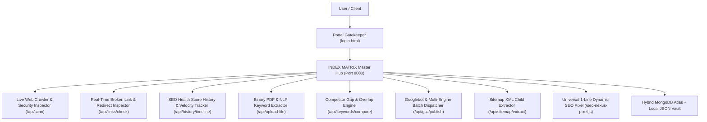

# ⚡ INDEX MATRIX — Unified SEO Engine & High-Speed Bot Indexer

> **A high-performance technical SEO automation suite, live DOM crawler, binary PDF & document NLP keyword extractor, competitor gap analyzer, real-time broken link inspector, SEO health velocity tracker, and search engine bot dispatcher powered by a unified single-port architecture, hybrid MongoDB persistence, role-based security permissions, and a dark cyberpunk glassmorphism interface.**

---

## 🌟 Platform Overview

**INDEX MATRIX** unifies enterprise on-page SEO diagnostics with high-velocity search engine bot indexing into a single, cohesive ecosystem running on port **`8080`**.



---

## 🎯 Key Capabilities & Architecture

| Feature | Description |
| :--- | :--- |
| **🚀 Single-Port Architecture** | All tools, APIs, and the bot indexer run simultaneously on **Port 8080** under the single unified **INDEX MATRIX** brand. |
| **🔐 Portal Gatekeeper & Session Lock** | Cryptographically signed HMAC-SHA256 session cookies, 1-click platform lock, and automatic unauthenticated redirection across all dashboard pages. |
| **🎨 Split-Dock 3D Login Transition** | Opens in Normal Overview Presentation mode by default; clicking **LOGIN** triggers a GPU-accelerated split-dock glide animation with a Three.js cosmic particle canvas. |
| **🍃 Hybrid MongoDB & Local Storage** | Seamlessly connects to MongoDB via `mongoose` using `MONGO_URI`. If offline or unconfigured, automatically operates with persistent local JSON storage (`data/users.json`, `data/history.json`, `data/dispatch-logs.json`). |
| **📄 Binary PDF & Document NLP Keyword Extractor** | Server-side binary `pdf-parse` v2 stream engine and NLP tokenization. Supports direct drag-and-drop for `.pdf`, `.txt`, `.csv`, `.docx`, and `.json` files, extracting 1-, 2-, and 3-word n-gram keyphrases, keyword density, volume estimates, and search intent classification. |
| **🔗 Broken Link & Redirect Inspector** | Live concurrent probing of internal and external hyperlinks for HTTP `200 OK`, `301/302` redirect loops, and `404/500` broken links with latency profiling and CSV exports. |
| **📈 SEO Health Score Velocity Tracker** | Longitudinal SVG progress and trajectory tracking over continuous audits with interactive metric switcher tabs (Overall, On-Page, Performance, Crawlability, Keywords). |
| **👤 Profile Setup Without OTP** | Logged-in users can update their Full Name and Phone Number instantly without OTP verification. |
| **📜 Password & Username Audit History** | Updating passwords or usernames automatically archives prior values into `passwordHistory` and `usernameHistory` with exact timestamps (`changedAt`). |
| **🛡️ Admin-Only History Deletion** | Regular users (`role: 'user'`) cannot delete crawl projects or clear bot dispatch logs (**HTTP 403 Forbidden**). Only administrators can delete records. |
| **🚀 Direct Real-Time Google Dispatch** | Send URLs directly to Google Search Console and bot endpoints without artificial delays or rate limits. |
| **🟢 Admin Control Center & Live Presence** | Dedicated Admin Portal (`admin/admin.html`) with real-time social-media style online presence (pulsing green dot tick), user phone numbers, full login/logout timestamps, and complete cross-user logs of Google dispatches and site crawls. |
| **🔒 Brute-Force Defense** | Automatically locks any IP after 5 failed login attempts for 15 minutes. |
| **⚡ SVG Radial Score Gauges** | Animated circular SVG radial progress gauges with dynamic color transitions (Emerald $\ge 90$, Cyan $70-89$, Amber $50-69$, Rose $< 50$). |
| **⚔️ Competitor Keyword Gap Engine** | Compares live DOM keywords against competitors to reveal shared terms, exclusive phrases, and keyword gaps. |
| **📦 Multi-URL & XML Sitemap Batch Indexer** | Auto-extracts child URLs from any `sitemap.xml` and runs sequential batch Googlebot and IndexNow pings. |
| **🔑 GCP Service Account Key Validator** | Validates Google Cloud Service Account JSON keys (`client_email`, RSA private key format, and Indexing API scopes). |
| **📄 Executive Client Report & PDF Exporter** | Generates a branded executive technical SEO report with overall health scorecards, checklist items, and `@media print` PDF exporter. |
| **⚡ Universal 1-Line SEO Pixel** | Embed `seo-nexus-pixel.js` on any external website for automatic Schema.org JSON-LD structured data and dynamic meta tag sync. |

---

## 🛠️ The 7 Integrated Tools

### Google Search Console Indexing API Setup

The app's `POST /api/gsc/publish` route now performs the real OAuth2 service-account flow and sends URL notifications to Google's Indexing API. To authorize it:

1. In Google Cloud Console, enable **Web Search Indexing API** for the project that owns the service account.
2. Create a service account and download its JSON key. Keep this file private and never commit it.
3. In Search Console, add the service account's `client_email` as an Owner or Full user of the exact URL-prefix or Domain property.
4. Open **Google Console > API Credentials Setup** in this app, upload the JSON key, verify it, and save it.
5. Scan a public, indexable URL and click **Inspect & Dispatch to Google**.

Google controls final crawling and indexing; an accepted notification is a request, not a guarantee of immediate indexing. The Indexing API is intended for eligible page types such as job posting and livestream pages. For ordinary pages, submit a sitemap in Search Console as well.

### 1. Portal Gatekeeper (`login.html`)
- Three.js interactive 3D particle cosmos background reacting to cursor motion.
- Opens in clean Overview Presentation mode showing system highlights, with smooth split-dock transition upon clicking the **LOGIN** button.
- Secure username and password authentication with "Remember Me" session persistence and registration toggle.

### 2. Master Dashboard & Live Web Crawler (`index.html`)
- Live HTTP/2 web crawler that extracts page titles, meta descriptions, H1-H3 heading hierarchies, canonical links, and network latency.
- **SEO Health Score History & Velocity Tracker**: Longitudinal SVG line & gradient area chart with metric switchers (*Overall*, *On-Page*, *Speed*, *Crawlability*, *Keyword Volume*) and hover checkpoints.
- Animated SVG radial score gauges for Overall, On-Page, Performance, Crawlability, and Mobile usability.
- User-scoped crawl project history drawer with health badges, keyword indicators, and 1-click project loader.

### 3. Fast Bot & Document Indexer (`indexer.html`)
- Instant search engine bot dispatch engine with real-time ISO timestamp terminal logs.
- Dual dispatch modes: **Single URL Dispatch** and **Multi-URL & XML Sitemap Batch Queue**.
- Real-time telemetry strip (Target format, HTTP reachability, robots directives, pipeline state).
- Role-aware cooldown countdown timer (20s for users, 10s for admins) and CSV log exporter.

### 4. Real PDF & Document NLP Keyword Extractor (`keywords.html`)
- **Interactive Dropzone**: Drag-and-drop or browse `.pdf`, `.csv`, `.txt`, `.json`, or `.docx` files.
- **Quick Preset Packs**: 1-click test datasets (*E-Commerce Tech Pack, B2B SaaS Cloud Pack, SEO Agency Pack, Local Services Pack*).
- Server-side binary parsing (`pdf-parse` v2) and client-side NLP tokenization.
- Extracts 1-word, 2-word, and 3-word n-gram keyphrases, exact occurrence counts, search volume estimates, and search intent classification (*Informational*, *Commercial*, *Transactional*, *Navigational*).
- Real-time keyword search filter, intent category tabs, 1-click CSV export, and clear/reset controls.
- **Competitor Gap Analysis**: Compare keywords against competitor URLs to discover rank opportunities.

### 5. Google Search Console Feeder & API Hub (`console.html`)
- Google Search Console direct indexing pipeline with Googlebot Smartphone inspection simulation.
- Google Cloud Service Account (`service-account.json`) drag-and-drop key parser and RSA PEM validator.
- Supports OAuth2 Google Cloud Service Account key uploads and direct JWT bearer authorization.

### 6. Technical SEO Audit & SERP Simulator (`audit.html`)
- Interactive Google Search Result (SERP) previewer with Desktop and Mobile toggle.
- **Real-Time Broken Link & Redirect Chain Inspector**: Probes all internal and external hyperlinks with status indicators (`200 OK`, `301/302 Redirect`, `404/500 Broken`), latency metrics, category filters, and CSV exporter.
- Real-time **Social Graph & OpenGraph Preview** (Facebook, Twitter, LinkedIn cards).
- Visual length recommendation meters for Meta Title (50-60 chars) and Meta Description (120-160 chars).
- Security & Protocol headers diagnostics (HSTS, CSP, X-Frame-Options, Viewport, Gzip compression).
- Target Keyword Placement matrix across Title, Description, H1, and Schema tags.

### 7. Schema Generator & Universal 1-Line Pixel (`reports.html`)
- Automated verified `Schema.org` JSON-LD structured data graph builder (`WebSite`, `Organization`, `WebPage`).
- **Executive Audit Report**: 1-click branded technical report modal with Save as PDF.
- 1-Click File Exporters for `schema.json`, `robots.txt`, `sitemap.xml`, and `meta-tags.html`.
- Dynamic 1-line script embed (`<script src="http://localhost:8080/seo-nexus-pixel.js"></script>`).

---

## ⚙️ Environment Configuration (`.env`)

Configure your `.env` file in the project root:

```env
# Application Brand Name
APP_NAME=INDEX MATRIX

# Master Server Port
PORT=8080

# Master Gatekeeper & Session Security
SESSION_SECRET=index_matrix_secure_session_secret_789324102

# Rate Limiting & Cooldown Controls
MAX_LOGIN_ATTEMPTS=5
GOOGLE_RATE_LIMIT=20

# Optional MongoDB Connection String
# (Connects to MongoDB Atlas or local instance; automatically falls back to local JSON if omitted)
MONGO_URI=mongodb+srv://<username>:<password>@cluster.mongodb.net/index_matrix

# Seed Default Credentials
DEFAULT_USERNAME=matrix_master
APP_PASSWORD=nexus2026
```

---

## 🚀 Getting Started

### 1. Installation & Launch
```bash
# Install dependencies
npm install

# Start the unified INDEX MATRIX server (Single command)
npm start
```

### 2. Accessing the Platform
Open your browser and navigate to:
```
http://localhost:8080/
```
*Unauthenticated requests will automatically be redirected to the Portal Gatekeeper (`/login.html`).*

**Default Admin Credentials (From `.env`):**
- **Username:** `matrix_master` (or value in `DEFAULT_USERNAME`)
- **Password:** `nexus2026` (or value in `APP_PASSWORD`)

---

## 📡 REST API Reference

### Authentication & Account
| Method | Endpoint | Description | Access |
| :--- | :--- | :--- | :--- |
| `GET` | `/api/config` | Returns dynamic application configuration & rate limit parameters | Public |
| `POST` | `/api/auth/login` | Authenticate user with username & password (Rate limited: 5/15m) | Public |
| `POST` | `/api/auth/register` | Register new user account directly into MongoDB | Public |
| `POST` | `/api/auth/logout` | Clear session cookie & terminate session | Public |
| `GET` | `/api/auth/me` | Check session state & active user profile | Private |
| `GET` | `/api/user/profile` | Get logged-in user profile, phone, role & audit history | Private |
| `PUT` | `/api/user/profile` | Update Name, Phone (No OTP), Username, or Password (Archives history) | Private |

### Crawling, Links & Analysis
| Method | Endpoint | Description | Access |
| :--- | :--- | :--- | :--- |
| `POST` | `/api/scan` | Live HTTP crawler, DOM analyzer & security header inspector | Private |
| `POST` | `/api/links/check` | Real-time concurrent probe for broken links (404/500) and redirects (301/302) | Private |
| `POST` | `/api/upload-file` | Binary PDF / Document extractor and keyword parser | Private |
| `POST` | `/api/keywords/compare` | Competitor keyword gap, shared term, and exclusive opportunity analyzer | Private |
| `POST` | `/api/sitemap/extract` | Discovers and extracts child URLs from XML sitemaps | Private |
| `POST` | `/api/gsc/verify-sa` | Validates Google Cloud Service Account JSON credentials | Private |
| `POST` | `/api/gsc/publish` | Google Indexing API & Bot dispatcher (10s Admin / 20s User cooldown) | Private |

### History & Auditing
| Method | Endpoint | Description | Access |
| :--- | :--- | :--- | :--- |
| `GET` | `/api/history` | Get user-scoped crawl project records from MongoDB | Private |
| `POST` | `/api/history` | Save crawl project record to user vault in MongoDB | Private |
| `GET` | `/api/history/timeline` | Get longitudinal SEO health score timeline checkpoints for progress tracking | Private |
| `DELETE` | `/api/history/:id` | Delete crawl record | **Admin Only (403 for Users)** |
| `POST` | `/api/history/clear-all` | Clear all crawl project records | **Admin Only (403 for Users)** |
| `GET` | `/api/logs` | Get user-scoped bot dispatch logs from MongoDB | Private |
| `POST` | `/api/logs/clear` | Clear bot dispatch logs | **Admin Only (403 for Users)** |

### Universal Pixel
| Method | Endpoint | Description | Access |
| :--- | :--- | :--- | :--- |
| `GET` | `/seo-nexus-pixel.js` | Universal 1-line dynamic SEO sync script | Public |
| `GET` | `/api/pixel/config` | Real-time meta and schema configuration provider for pixel | Public |

---

## 🧪 Automated Testing Suite

The repository includes a comprehensive 100% passing automated test suite:

```bash
# Run all automated tests (Core API, Binary PDF Parser & UI Assets)
npm test

# Run API, Auth, MongoDB Isolation, Link Inspector & Timeline tests only
npm run test:api

# Run Binary PDF & Document Upload tests only
npm run test:pdf
```

---

## 📁 Repository Structure

```
.
├── server.js                   # Unified Master Backend & API Server (Port 8080)
├── db.js                       # Hybrid MongoDB (Mongoose) + Local File Storage Engine
├── admin/
│   └── admin.html              # Dedicated Admin Control Center (Live Presence, Dispatches & Audit)
├── login.html                  # Three.js 3D Cosmic Gatekeeper & Split-Dock Auth Card
├── index.html                  # Master Dashboard, Web Crawler & Score History Velocity Tracker
├── indexer.html                # Fast Bot Indexer, Batch Queue & Sitemap Dispatcher
├── keywords.html               # Binary PDF NLP Keyword Extractor & Competitor Gap Engine
├── console.html                # Google Search Console Feeder & GCP Service Account Validator
├── audit.html                  # Broken Link Inspector, SERP Simulator, Social Graph & Security Headers
├── reports.html                # Schema.org JSON-LD Exporter & Executive Report Generator
├── seo-nexus-pixel.js          # Universal 1-Line Dynamic SEO Pixel Script
├── test/                       # Automated Test Suite
│   ├── test-api.js             # Core API, Auth, Database, Isolation & Link Inspector Tests
│   ├── test-pdf-scan.js        # Binary PDF & Document NLP Keyword Extractor Tests
│   └── test-ui-pages.js        # UI Page Delivery & Static Asset Integrity Tests
├── css/
│   └── style.css               # Unified Cyberpunk Dark Glassmorphism Design System
├── js/
│   ├── app.js                  # Master Reactive State, Profile Modal, Timeline & History Manager
│   ├── indexer.js              # Fast Bot Indexer Client Engine & Cooldown Timers
│   ├── pdf-parser.js           # Client & Server NLP Tokenizer
│   └── console-feeder.js       # Google Indexing API Connector
├── data/
│   ├── users.json              # Local Persistent User Database Fallback
│   ├── history.json            # Local Persistent Crawl Projects Database Fallback
│   └── dispatch-logs.json      # Local Persistent Bot Dispatch Logs Database Fallback
├── .env                        # Environment Configuration
├── package.json                # Project Metadata, Dependencies & Test Scripts
└── README.md                   # Complete Platform Documentation
```

---

&copy; 2026 INDEX MATRIX. All rights reserved. Built for technical search engine optimization & high-velocity bot indexing.
